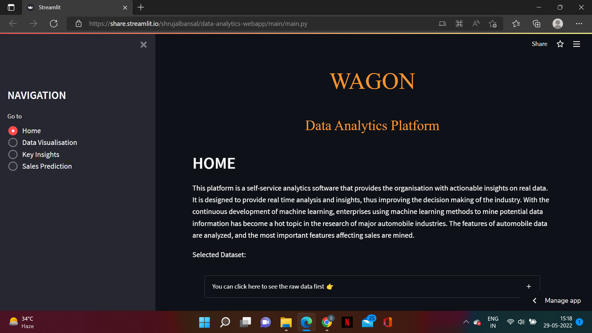

# Data-Analytics-WebApp

<a href="https://share.streamlit.io/shrujalbansal/data-analytics-webapp/main/main.py" target="_blank">Link to WebApp</a>
<a href="https://www.youtube.com/watch?v=mdgzVmPjIf4" target="_blank">Link to Demo Video</a>

# About the Project

Wagon: A Data Analytics project built during Microsoft Engage 2022 program. 
It is a data analytics application through which we can predict the sales of a particular vechicle based on the specifications entered by the company.
It is built to enable automotive industry to harness data and take informed decisions. Demonstrate the use of data analytics in identifying: -Customer segments -Most popular car specification combination(engine type, fuel, mileage, etc) -Right time to launch a new car, etc.

# Platform features
Data Visualization: Users can easily drill down on any metric and flexibly cut data by car category, customer segments, launch time period, , manufacturer model and more for granular insights. 

Key Insights: Provides the user with data driven insights to answer key business questions and help take informed decisions. Pre-defined queries are available for the user to analyze and observe data closely.

Sales Prediction model: Integrated Machine Learning algorithm to predict car sales based on model specifications to inform design and production planning

# ML Model Development Steps

Data Treatment

 1)Univariate Analysis
-Data treatment for missing values and outliers
-Encoding Categorical Variables

2)Bivariate Analysis
-Correlation with dependent variable
-Multicollinearity check using VIF

Train/Test Split - 80:20

Model Training and selection

-Benchmark model – linear regression

-Alternate models based on other techniques – SVM, decision tree, random forest

-Model selection based on performance (R-squared) on test sample

## Navigating through the App

### HOME PAGE

### DATA VISUALISATION PAGE

### KEY INSIGHTS PAGE

### SALES PREDICTION PAGE

